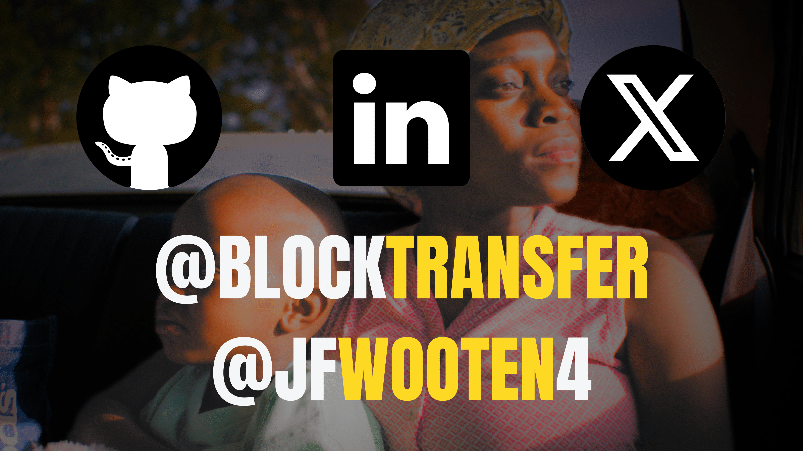

# [Decentralizing Capitalism](https://www.decentralizingcapitalism.com) 🌐

## 📜 A [Financial System](https://stellar.org) for Everyone - [Starting With Free Education](https://www.ninetonoonsecrets.com/free-book) 🌍

---

### Forging Change: Comment Letters 📄

#### - [S7-15-23](https://wooten.link/EDGAR)
#### - [SR-OCC-2024-001](https://wooten.link/OCC)
#### - [S7-27-15](https://wooten.link/TAR)

---

### Reimagining Asset Management 💡
We're not just building an online platform; we're striving for a democratic shift in asset management. I'm dedicated to creating an equitable financial system for the other 7 billion citizens without access to quality investments.

### Unshackling Financial Barriers 🛠
This work rebels against the tyranny of centralized financial institutions. Our algorithms and platforms aim to give everyone, regardless of socio-economic status, a fair shot at financial stability.

### A New Trust Infrastructure 🔒
Blockchain isn't a fad; it's the future. It moves the locus of trust from opaque corporations to transparent codes and communities.

---

## Nurturing Independent Money Managers 🚀

### The Paradigm Shift 🔄
We're setting the stage for independent money managers to rise and thrive in a decentralized system. It's about providing opportunities based on merit, talent, and hard work, not just institutional backing.

### Empowerment Through Decentralization 🌐
The decentralized nature of our system offers more personalized, efficient, and transparent asset management services without traditional costs and limitations. No more must you trust PDF broker statements.

---

## Join the Revolution 🛠

### Beyond Code 📚
Your expertise is crucial, but it's your principles that will fuel this revolution. By contributing to our projects, you're not just coding; you're laying down the ethical and technological foundations of a new financial system.

### The Journey Ahead 🗺
We have a vision and the roadmap to a democratized financial future. What we need is you—your skills, your principles, and your commitment to change. Together, let's build financial systems that are by the people, for the people.

